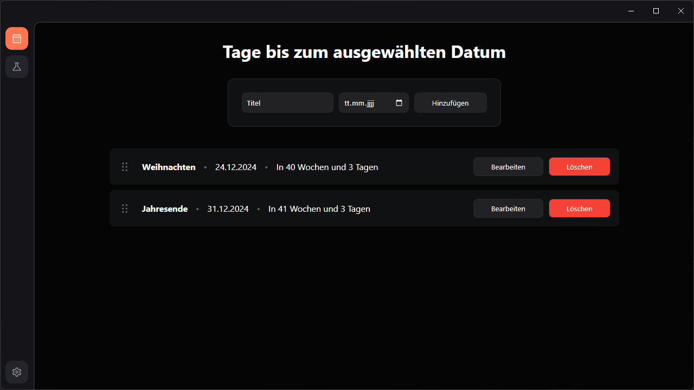

# Timespan-Tracker

<p>Timespan-Tracker is an Electron app with which you can find out the time span between a date and today.</p>

<br>



## How to use

### Clone the repository

``` batchfile
git clone https://github.com/DaBorsten/Timespan-Tracker.git
```

---

### Install all dependencies

> <p>Run <code>npm install</code> in the directory of the repository.</p>

``` batchfile
npm install
```

---

### Run the code

> <p>Run <code>npm start</code> in the directory of the repository.</p>

``` batchfile
npm start
```

---

### Installer

> <p>Adjust the installer to your liking.</p>
> <p>You can find the settings in <code>package.json</code> under <code>"build"</code>.</p>

---

### Build the code

> <p>Run <code>npm run build</code> in the directory of the repository.</p>

``` batchfile
npm run build
```

<hr>

### Open the installer

> <p>You can find the installer in the directory <code>dist/</code>.</p>